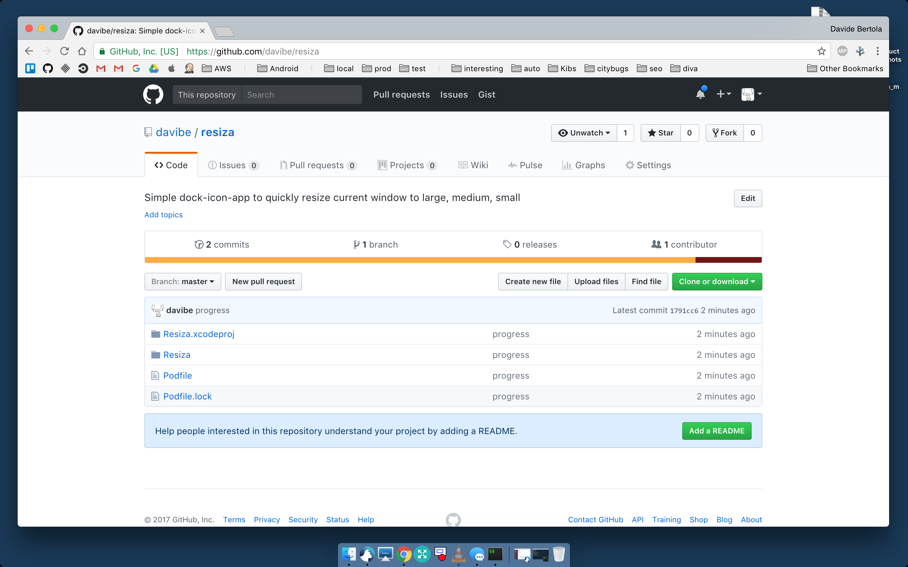
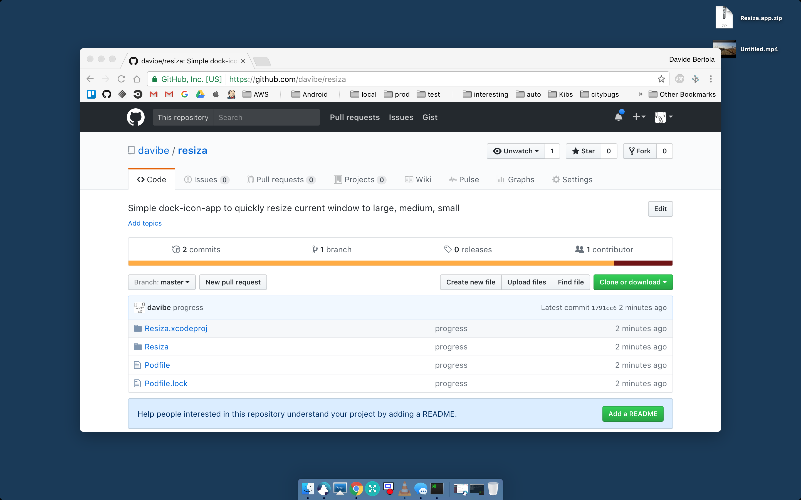
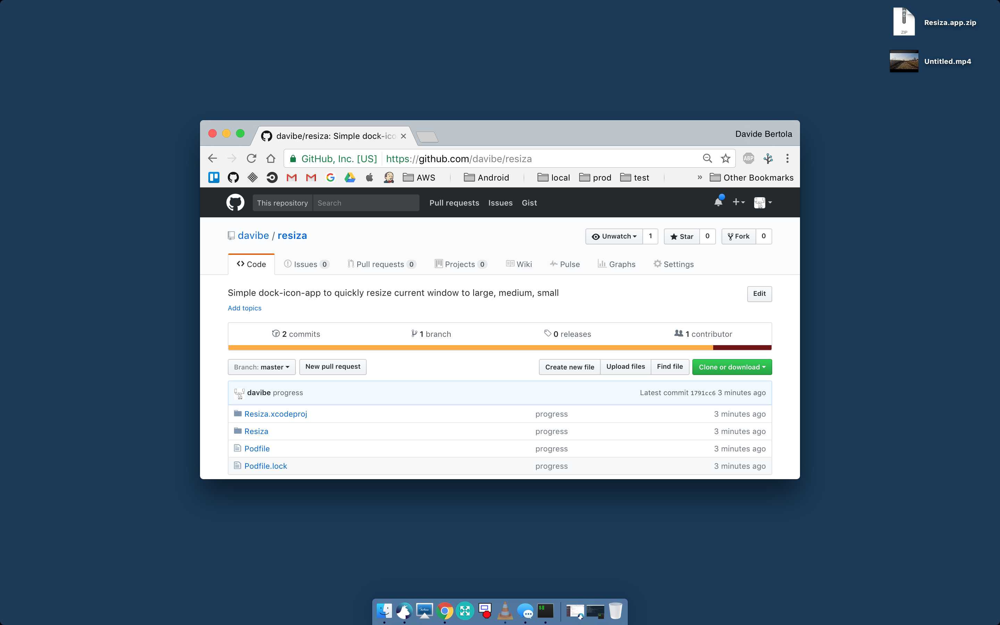
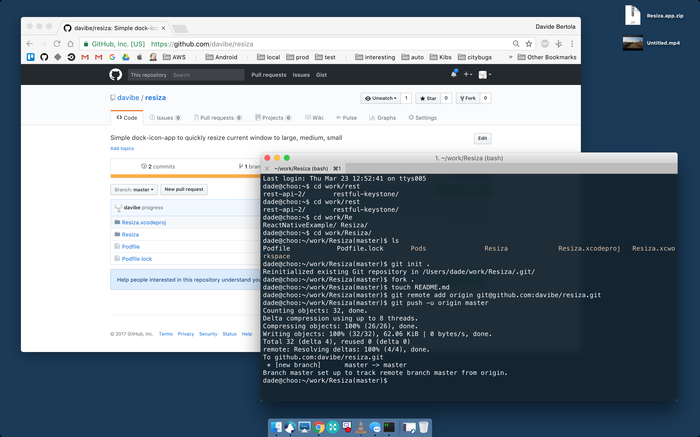

README
------

A simple dock icon app that resizes the current front most window. Every time its launched the window assumes one of 3 states (sizes): large, medium, small.

Those sizes are calculated:
- as % of the screen
- taking into account dock and menubar space
- adding a border around the window so that even when the window is large there 
  is always some space around it for drag/drop operation or to simply look at the background.

While this may seem stupid / useless / oversimplified at first 
I found myself using it on a daily basis. 
I can't explain what does this app solve so i jsut decided to share it :)

Examples

